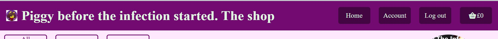
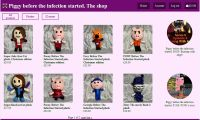
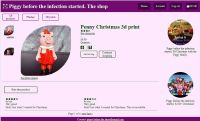
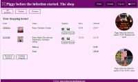
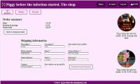
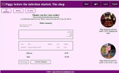
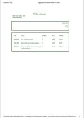
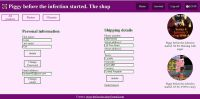
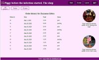
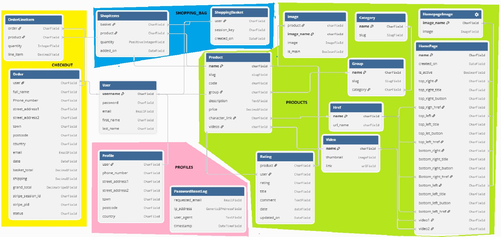

# Piggy before the infection started.The shop.

[View the finished project here.](https://piggy-before-the-shop-260efcf00781.herokuapp.com/)

Through the years, Piggy before the infection started has garnered an ever increasing group of faithful followers. 

Piggy before the infection started-The shop is the exclusive official merchandise site for the Piggy before the infection started series. 

It aims to look after the series' fans as well as increase the reach of the series.

## Contents.

1. [Business goals.](#1-business-goals)

2. [User needs](#2-user-needs)

3. [User stories](#3-user-stories)

4. [Plan](#4-plan)

5. [Features](#5-features)

6. [security](#6-securiy)

7. [Models and views](#7models-and-views)

8.- [Use of AI](#8-use-of-ai)

9.- [Testing](readme/tests.md)

  1. [Automated testing](readme/tests.md#1-automated-testing)

  2. [Manual testing](readme/tests.md#2-manual-testing)

  3. [User stories](readme/tests.md#3-user-stories)

  4. [User experience](readme/tests.md#4-user-experience)

  5. [Responsiveness](readme/tests.md#5-responsiveness)

  6. [Validation](readme/tests.md/#6-validation)

  7. [Lighthouse](readme/tests.md#7-lighthouse)

10.- [Issues](#10-issues)

11.- [Deployment](#11-deployment)

12.- [Languages used](#12-languages-used)

13.- [Frameworks, packages and libraries](#13-frameworks-packages-and-libraries)

14.- [Media](#14-media)

15.- [Displayed items](#15-displayed-items)

16.- [Acknoledgements](#16-acknoledgements)

## 1. Business goals.

- To provide exclusive merchandise for Piggy before the infection started series.

- To increase the reach of the Piggy before the infection started series.

- To make Piggy before the infection fans feel looked after.

## 2. User needs.

### Fans needs.

- To be able to easily browse through the items.

- To have clear information about the products offered.

- To be able to save their shopping basket and return  to it later.

- To be able to securely pay for the items bought.

- To receive updated information about the state of their order.

- To be able to write reviews and read reviews made by other users.

### Creator's needs.

- To be able to easily add, modify and delete products.

- To be able to easily add, modify and delete promotions.

- To be able to easily change the video offer panel.

- To be able to  contact users about new offers and products.

## 3. User stories.

- As a user I want to be able to  easily  register, log in and log out of my account so that I can access the site.

- As a user I want to be able to easily change my password so that  if I forget it I can get into my account

- As a user I want to have a profile so that I can see my order history and complete checkout quickly.

- As a user I want to be updated when my order is on its way so that I can be informed.

- As a user I want to be able to navigate through the products easily so that I can see what is on offer.

- As a user I want to be able to search products by category and character so that I can find what I want easily.

- As a user I want to be able to see the specific information for the product that interests me so that I can make a decision.

- As a user I want to be able to read and write reviews so that I can see what other users think about a product before I buy and make my opinion count.

- As a user I want to be able to add items to the basket so that I can purchase them.

- As a user I want to be able to modify  items on the basket so that I can refine my purchase.

- As a user I want to  see how much I have spent so far so that I can decide whether to continue buying.

- As a user I want to be able to pay for my items securely so that my personal information is not compromised.

- As a user, I want to be able to see my order history so that I can Keep track of what I have ordered.

- As the creator I want to be able to  add, remove and modify products so that my offer is always up to date.

- As the creator I want to be able to  see a list of the items that have been sold and the state of the orders so that I can ensure a fast service.

## 4. Plan.

From the users point of view, the site will have four main pages. The home page will show a header with buttons to log in and register and a footer with links to  appropriate sites  and newsletter registration. Once the user has logged in, the header will show buttons to log out, go to account and shopping basket.

On the body, there will be a side panel with suggested videos and a middle section which will work as a navigation to see the different categories of products and offers.

[Intitial home page wireframe. Desktop](/readme/images/wireframes/initial_home.jpg)

[Initial home page wireframe. Small screen](/readme/images/wireframes/initial_home_small.jpg)

The products page will have the same format, with the list of products on the middle section.

The individual product page will show the information about the product with a choice of pictures, the ability to add to the basket, and a rate the product section where the shopper can read and write reviews for the product.

[Initial product detail wireframe.](/readme/images/wireframes/initial_detail.jpg)

The shopping basket will show the products, quantity and final price and will allow to check out safely.

[Initial shopping basket wireframe.](/readme/images/wireframes/initial_shopping_bag.jpg)

On the creator’s side of the site, there will be features to add, modify and delete products and offers and see list of product sold on a period of time.

The account link will lead to a page where the user can see and modify their personal information, as well as see their purchase history and details about any specific order.

## 5. Features

### Customisable homepage. 

The homepage features a main navigation bar with a smaller navigation area underneath with links to all products, plushes and 3d prints. A vertical section contains links to content related videos.

This structure is continued in all pages thorough the site.

The main area of the homepage is divided into four completely customisable sections, with the option to include a picture, a title and a link (which can be external or internal). The content of these sections is controlled by the Homepage model, which also controls the video links in the vertical section for all pages not featuring individual products.

### Main navigation bar.

When first arriving to the site, the navigation bar contain links to go home, shopping basket, log in and register.
On logging in, the links turn into go home, account, log out and shopping basket.

### Products pages.

The products page lists the products with a picture, name and price. Eight products are displayed by page. The products can be separted into plushes and 3d prints by clicking on the relevant buttons.

### Product detail pages.

Clicking on one of the products in the products page leads to the individual product page. The detail page features an information area separated into pictures and textual information. The images section has a main picture and smaller images next to it. Clicking into one of the smaller images places it in the main picture area. The link to see a large image opens an enlarged image of the image displayed in the main image area in a new window.

The textual information contains the name of the product followed by the star rating of the product, a link to find more information about the character depicted by the product, a description, the product price and a quantity area which the user can increase or decrease by clicking on the up and down arrows. Buttons to add the product to the basket and continue shopping are also provided.

Under the  product information is the reviews area featuring two reviews per page. Users can add new reviews as well as update or delete reviews they had previously written.

### The Basket page.

The price of the products already on the shopping basket is shown in the shopping basket button on the main navigatiton bar. On adding a product to the baset, the amount is changed accordingly.

On clicking on the shopping basket button, the shopping basket page loads. It shows the products that have been added to the basket as well as an area in which the user can use the up and down arrows to modify the quantity of each product or remove it. Delivery costs have been added and the total cost of the order calculated.

Items can be saved to the basket whether the user is logged in or not. On logging in, the items that had been added while not logged in are added to the items that were previously saved on the user's basket.

The page has links to proceed to checkout and continue shopping.

### Checkout page.

The checkout page is divided into two areas. The first one contains the order summary while the second one has the shipping information.

If the user is not logged in, they have the option to either log in or continue as a guest. If they log in, the information saved into their profile is loaded onto the form. They can use it as it is, or ammend it if necessary. If the shipping information is ammended, the user has the option to save it to their profile or use it only on that order.

Once ready, the user can proceed to secure checkout.

### Secure checkout.

Secure checkout is provided by stripe.

### Order invoice.

On successful payment of the order, the user is directed to the thank you page where the invoice of the order is provided. A link to print the invoice is provided.

        

### Profile.

Once the user has logged in, the account button on the main navigation area directs the user to their profile.

There, the user can update their personal information and shipping details, change their password and email address and access their order history.

### Order history page.

The order history page featues a list of all of the user's past orders. Clicking on them, the order invoice can be seen and printed.

## 6. Securiy.

The site can be used by registered and unregistered users. Banking information is kept by stripe, so it is never stored or seen on the site.

Personal information the site stores about the users contain their names, shipping details and email addresses.

Email addresses have to be verified before a user is fully registered. The password can only be reset in two different ways. The forgotten password link on the log in page emails the user a link to reset their password. On successful complection of the password reset, a record is kept on the PasswordResetLog model. The password reset facility on the profile page requires the user to be logged in to be accessed.

If the user decides to change the email address on their profile, they must got through the email verification process again.

Users can use a different email address for specific orders but those are only recorded on the Order model for order processing and not on their profiles.

Checkout pages have been blocked from indexing to prevent them from being shown to the public on search engines.This results in the SEO for those pages being 66%.

## 7.Models and views.

### Models

This is the entity relationship diagram of the models used in this project. The different colour areas show how the models are distributed through the different appications.

The product app contains all the models related to the products. This includes the Product model for all the different products and its associated models, Category and Group to divide the different groups of products, Image to contain the product images, Href to contain the links to information about the product character in wikipedia, Video for the suggested videos featuring the character and the Rating modiel for reviews of the products. It also contains The Homepage model with the information that will be shown in the homepage and its associated HomepageImage model.

The shopping_bag app contains the ShoppingBasket and ShopItems models, while checkout contains the Order and OrderLineItem models.

The profiles app contains the Profile model as well as he PasswordResetLog model to record password changes as required by legal regulations.

### Views

This are the views used on the site.

|View|App|Form|Template|Function|
|:---|:---|:---|:---|:---|
|home_page|products|--|products/home.html|Displays home page|
|all_products|products|--|products/all_products.html|Displays a list of all products|
|plushes|products|--|products/plushes.html|Displays a list of all plushes|
|prints|products|--|products/plushes.html|Displays a list of all 3d prints|
|product_detail|products|--|products/product_detail.htms|Displays information about a product|
|rate_product|products|products.RatingForm|products/rate_product.html|Allows a review to be recorded|
|update_review|products|products.RatingForm|products/update_product.html|Allows a review to be updated or deleted|
|get_basket|shopping_bag|--|--|Creates or retrieves a basket|
|shopping_bag|shopping_bag|--|shopping_bag/shopping_bag.html|Displays the shopping basket.|
|add_to_bag|shopping_bag|--|--|Adds items to the bag|
|update_bag|shopping_bag|--|--|Updates the quantity of an existing item in the basket|
|remove_from_basket|shopping_bag|--|--|Removes an item from the basket|
|bag_contents|shopping_bag|--|--|Makes shopping basket details available across the site.|
|checkout|checkout|checkout.UserForm checkout.OrderForm |checkout/checkout.html|Displays the order informataion.|
|payment_success|checkout|--|checkout/success.html checkot/error.html|Displays success or fail status after checkout.|
|payment_cancel|checkout|--|checkout/checkout.html|Handles cancelled stripe sessions|
|profile|profiles|profiles.UserForm profiles.ProfileForm profiles.EmailForm|profiles/profile.html|Displays user's profile information.|
|order_history|profiles|--|profiles/order_history.html|Displays a list of all user's past orders.|
|past_order_detail|profiles|--|profiles/past_order_detail|Displays details of a past order.|

## 8. Use of AI.

The following features were developed using AI assistance:

- Products app: Custom context processor to dynamically inject YouTube videos into templates.

- Profiles app: PasswordResetLog model to comply with legal requirements referring to use of forgotten password feature.

- Profiles app: EmailForm form to require password to change the email address.

- Profiles app: Adapter to redirect allauth change_password template to profile page.

- Shopping_bag app : Signals to merge anonymous and logged-in user shopping baskets.

- Shopping_bag app: Helper function to retrieve or create basket.

- settings.py: Code to record reset password requests for Heroku loggins.

## 9. Testing.

The log for all the tests done can be found [here](/readme/tests.md).

## 10. Issues.

The email confirming the order was successfully processed currently ends up in the recipient's junk email. This is probably due to the fact that the email content is business based while the sender's email has been registered as a personal email address.

## 11. Deployment.

he project was managed in [github](https://github.com) and deployed to [heroku](https://id.heroku.com/login).

The process followed to deploy was:

- Once logged into Heroku, navigate to the 'new' button on the top right corner and click on 'create new app'.
- Give the app a name.
- Choose your location.
- Click on 'create app'.
- Click on 'settings' and 'reveal config vars'
- Set the appropriate keys.
- From the app dashboard, click on 'Deploy'.
- In Deployment method, select GitHub.
- Search for the repository name.
- Click on 'connect'.
- Choose a branch to deploy from.
- Click on 'deploy branch'.
- Move to the top of the page and click on 'Open app'.

The following keys were set up: ALLOWED_HOSTS, CLOUDINARY_URL, DATABASE_URL, EMAIL_HOST_PASSWORD, SECRET_KEY, STRIPE_PUBLIC_KEY and STRIPE_SECRET_KEY.

The site can be accessed from: [here](https://piggy-before-the-shop-260efcf00781.herokuapp.com/)

To fork the project:

- On Github, mavigate to the [project page]( https://github.com/louisae452/Piggy-before-the-infection-started.-The-shop)
- Click on the fork icon.
- Select new branch.
- Give the branch a name and save.

To clone the project:

- On Github, navigate to the [project page]( https://github.com/louisae452/Piggy-before-the-infection-started.-The-shop)
- Click on the code button.
- Copy the address shown.
- Open your code editor.
- On the terminal, navigate to the desired directory.
- Type 'git clone' followed by the address you copied.
- Press enter.

## 12. Languages used

HTML, CSS, JavaScript, Python

## 13. Frameworks, packages and libraries.

- Django 6.0.7

- To manage sensitive data: django-environ 

- To manage database: psycopg2 

- For enhanced authentifcation: django-allauth

- To manage deployment to heroku: gunicorn

- To manage deployment of static files: WhiteNoise

- To provide a rich text editor: django-summernote

- To serve image files: cloudinary, dj3-cloudinary-storage urllib3

- To handle payments: stripe

- To run automated tests: pytest

- To convert image to webp: [ToWebP](https://towebp.io/)

- [Django-environ documentation](https://django-environ.readthedocs.io/en/latest/)

- [stripe docs](https://docs.stripe.com/get-started?locale=en-GB)

- Passwords in online services. [ico](https://ico.org.uk/for-organisations/uk-gdpr-guidance-and-resources/security/a-guide-to-data-security/passwords-in-online-services/)

- Passwords administratoin for system owners [National Cyber Security centre](https://www.ncsc.gov.uk/collection/passwords/updating-your-approach)

- To send emails. [Resend](https://resend.com/docs/send-with-django)

- PostgreSQL JSON tutorial [Neon](https://neon.com/postgresql/tutorial/json)

- Model properties [DEV](https://dev.to/doridoro/django-model-properties-28ac)

- Effortless pagination in Django. [Medium]https://medium.com/@pirson/effortless-pagination-in-django-from-basics-to-best-practices-2bd3c0d7d710)

- Accessing and using cleaned data. [Medium](https://awstip.com/accessing-and-using-cleaned-data-making-django-forms-work-for-you-5f32a379e32b)

- Printing queries. [Mmdn](https://developer.mozilla.org/en-US/docs/Web/CSS/Guides/Media_queries/Printing)

- Testing pagination. [BrowserStack](https://www.browserstack.com/guide/test-cases-for-pagination-functionality)

- Mock object library. [Real Python](https://realpython.com/python-mock-library/) 

- Mock and MagicMock. [Medium](https://medium.com/@snehagiranje05/unveiling-the-magic-understanding-mock-and-magicmock-in-python-ecadf1f1013c)

## 14. Media

All the images and videos portrayed on the site have been created by SuperJakeJosesCat.

## 15. Displayed items

The items presented on the site were designed by SuperJakeJoseCat to portray characters created by Minitoon for the ROBLOX game Piggy and SuperJakeJoseCat for the YouTube series Piggy before the infection started.

Plushes were crafted by SuperLuisaCat and SuperJakeJoseCat and 3D prints by SuperJakeJose Cat.

All the items belong to SuperJakeJoseCat's private collection and are not for sale.

## 16. Acknoledgements

[View the finished project here.](https://piggy-before-the-shop-260efcf00781.herokuapp.com/)